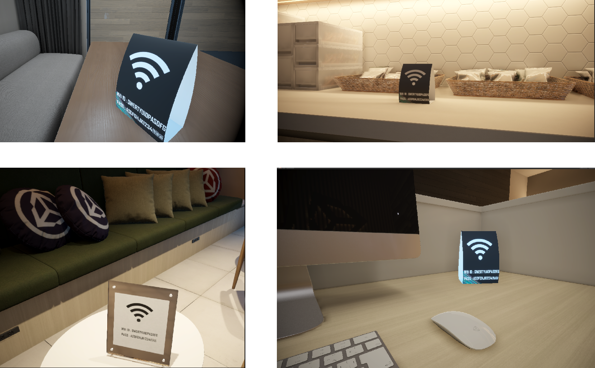
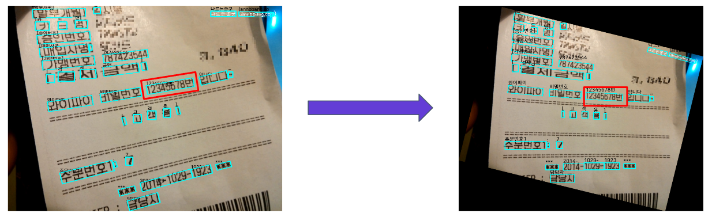
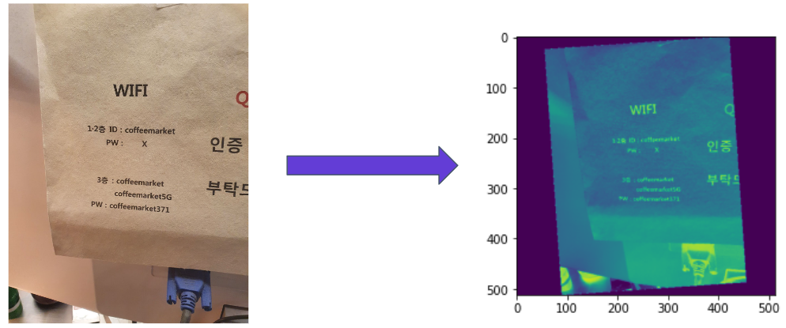
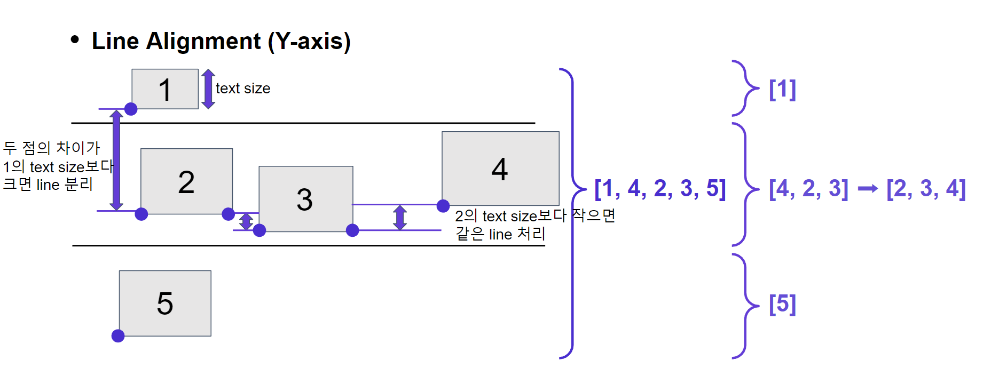
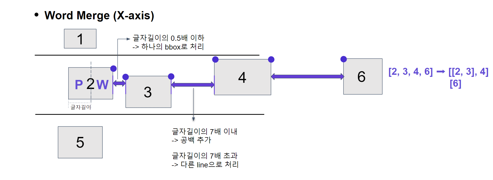
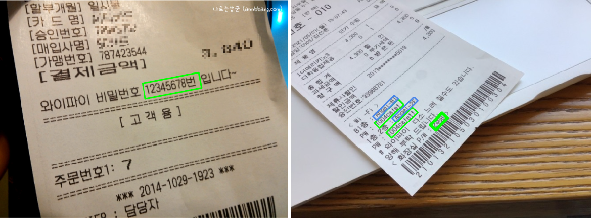
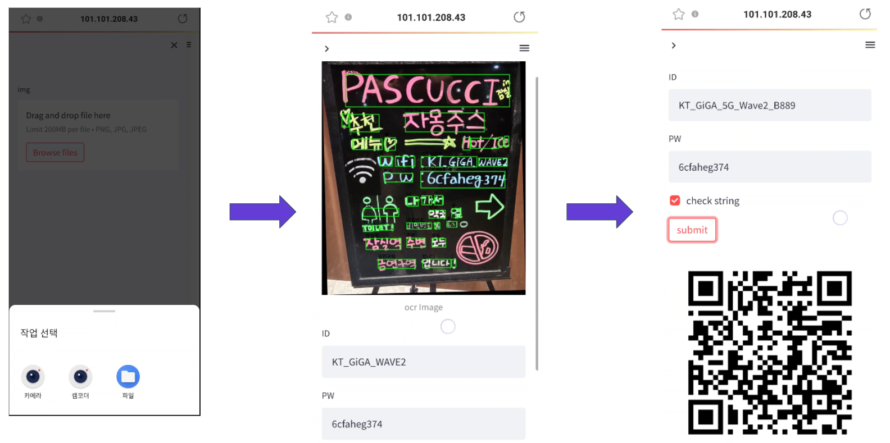

<h1 align="center">Welcome to Wi-FiNDER </h1>
<p>
</p>
<center>
    
</center>


> Wi-FiNDER (Upstage 기업 연계 프로젝트)

### 🏠 [Github](https://github.com/boostcampaitech3/final-project-level3-cv-04/) :clapper:[Demo 시연영상](https://youtu.be/IKsppr5SVKE) :microphone:[프로젝트 소개 영상](https://drive.google.com/file/d/1CDbswk-U4lzvJqW4Iq9fQaYJOFJAwOCR/view?usp=sharing) 📝[Presentation](https://drive.google.com/file/d/11YrYIOD5kfd7FJ-Ida2N3tovqNDhWZcB/view?usp=sharing)

<br>


## ✨ Description

```sh
Wi-FiNDER는 WiFi Image가 들어왔을 때 ID와 PW 값을 추출하여 
사용자가 보다 빠르고 편리하게 WiFi 연결을 할 수 있게 해주는 서비스 입니다.
```

<br>


## :pushpin: Project Goal

```sh
다들 카페에서 노트북을 쓰실 때 와이파이 안내판을 찍어서 친구와 카톡으로 공유하거나 
복잡한 암호 때문에 패스워드를 여러번 입력하신 적이 있으실겁니다.
저희 프로젝트 목표는 와이파이정보가 담긴 사진이 들어왔을 때 아이디와 패스워드값을 
자동으로 추출하여 사용자가 보다 편리하게 와이파이를 연결 할 수 있는 서비스를 제공하는 것입니다.
다양한 WiFi 정보 표기 방식에도 ID, PW 값을 정확하게 추출하는 것을 목표로 두었으며,
특히 많은 Text가 담겨있는 영수증에서도 WiFi ID, PW를 빠르게 추출할 수 있습니다.
```

<br>


## ⏱ Development Schedule

<center>
    
</center>

<br>


## 📃 Pipeline

<center>
    
</center>

<br>


## 🗂 Dataset

### 1. Data Scraping

<center>
    
</center>

> 다양한 플랫폼에서 WiFi 정보를 담은 이미지 데이터 수집 후 cleansing 실시


### 2. WiFi template

<center>
    
</center>

> WiFi template 이미지에 랜덤한 문자열을 ID, PW의 위치에 넣어 합성 이미지 생성


### 3. Unity

<center>
    
</center>

> Unity를 이용해 가상 현실로 구현한 카페 Scene에 WiFi 포스터를 다양한 위치에 두고 여러 구도에서 이미지 생성


### 4. Data Annotation

<center>
    
</center>

> CVAT Annotation Tool을 활용해 `WiFi Logo`, `WiFi poster`, `ID`, `PW` 에 대한 annotation 진행

<br>


## 🖥Model

### YOLOV5I6 (for Detection)

### 1. train data

<center style: "">
    
</center>

> WiFi Logo와 WiFi Poster를 annotation한 데이터로 학습

### 2. poster detection

<center>
    
</center>

> WiFi Logo가 포함되어 있는 Poster를 detect하고, 해당 영역을 crop하여 사용

<br>


### UNet++ (for Segmentation)

### 1. train data

<center>
    
</center>

> WiFi ID와 WiFi PW를 annotation한 데이터로 학습

### 2. 3-channel input

<center>
    
</center>

> ch1: gray scale이 적용된 image

> ch2: 모든 text 위치의 masking image

> ch3: key 값을 가진 text 위치의 masking image


### 3. Augmentation

- Real Data

<center>
    
</center>

> Blur, ShiftScaleRotate 를 통해 이미지 데이터 증강

- Template Data

<center>
    
</center>

> Real Data에 비해 너무 깨끗한 정면 이미지이므로 MotionBlur, ElasticTransform 를 통해 noise 생성

### 4. input & output & matching

<center>
    
</center>

> input, output과 output을 ocr bbox와 matching 한 결과

 `id`, `pw`를 key값으로 지니고 있으며, 각각 text 값과 bbox 위치정보를 담아 post processing에 활용

<br>


## 📥 Pre-Processing

### 1. Rotation

<center>
    
</center>

> WiFi ID와 PW가 가로폭이 길고 세로폭은 상대적으로 짧아 가로길이/세로길이 값이 가장 큰 (가장 Narrow한) bbox를 회전

OCR엔진의 글자인식 성능향상, 각각의 bbox로 잡던 것들을 한번에 잡아 Post-Processing하기 용이


### 2. Image Padding

<center>
    
</center>

> Input Image를 3:4 비율로 Padding을 적용시켜 Training

UNet 모델 학습시 Input은 512x512의 크기로 고정 -> 3:4의 비율로 Resize 및 Padding 하여 학습

스마트폰으로 찍히는 사진 대부분이 3:4 비율이기때문에 실제 서비스 시 들어오는 데이터와 유사하게 바꿔 성능 향상 기대

<br>


## 📤 Post-Processing

### 1. Line Alignment (Y-axis)

<center>
    
</center>

> 같은 라인 bbox 좌하단 지점의 y좌표를 기준으로 text size를 비교해 글자 순서에 맞게 출력


### 2. Word Merge (X-axis)

<center>
    
</center>

> 같은 라인의 글씨는 유사한 크기라 가정하고, 자간이 x좌표 길이의 1/2보다 작을 경우 같은 글씨로 출력


### 3. Final postprocessing

<center>
    
</center>

> 모델이 출력하는 최종 결과물을 바탕으로 value값 정제 과정 추가

1. PW 길이 8 미만, 한글 제외

2. Key값과 같이 잡히는 경우 제외 (ID:WIFI123 -> ‘:’를 기준으로 split하여 WIFI123만 출력)

3. 영수증에 주로 비밀번호로 출력하는 영수증 일련번호 양식 제외

<br>


## 🖨 Overview

<center>
    
</center>

> streamlit을 활용해 구현하였으며, 이미지 입력으로부터 결과를 출력하기까지 2.97초 정도 소요

실제 ID, PW와 같이 다르다면 사용자가 직접 수정 가능

체크박스를 클릭하면 사용자가 최종적으로 수정한 정보를 DB에 저장

`submit` 버튼을 누르면 와이파이 정보가 담긴 QR코드를 생성해내며, QR코드를 인식하면 Wifi 자동 연결

<br>


<!-- 
## :runner: Steps to run Demo

```bash
$ npm install requirements.txt
$ cd code
$ steamlit run rule_based_method.py
``` 
-->

<br>


## 🤼‍♂️Author

🐯 **[Roh Hyunsuk](https://github.com/titiman1013)**

🐶 **[Shin Hyeonghwan](https://github.com/vhehduatks)**

🐺 **[Oh Wonju](https://github.com/PancakeCookie)**

🐱 **[Lee Joonhyun](https://github.com/JoonHyun814)**

🦁 **[Lee Hyunsuk](https://github.com/p0tpourri)**

<hr>
<br>


## 📝 License

Copyright © 2022  Sauron's eyes  <br>

