<h1 align="center">Welcome to MODU </h1>
<p>
</p>
<center>
    
</center>


> Wi-FiNDER (Upstage 기업 연계 프로젝트)

### 🏠 [Github](https://github.com/boostcampaitech3/final-project-level3-cv-04/) :clapper:[Demo 시연영상]() :microphone:[프로젝트 소개 영상]() 📝[Presentation]()

<br>


## ✨ Description

```sh
Wi-FiNDER는 WiFi Image가 들어왔을 때 ID와 PW 값을 추출하여 
사용자가 보다 빠르고 편리하게 WiFi 연결을 할 수 있게 해주는 서비스 입니다.
```


## :pushpin: Project Goal

```sh
카페나 식당과 같은 공공장소에서 제공해주는 WiFi 정보를 좀 더 빠르게 
접근하고, 직
```


## ⏱ Development Schedule

<center>
    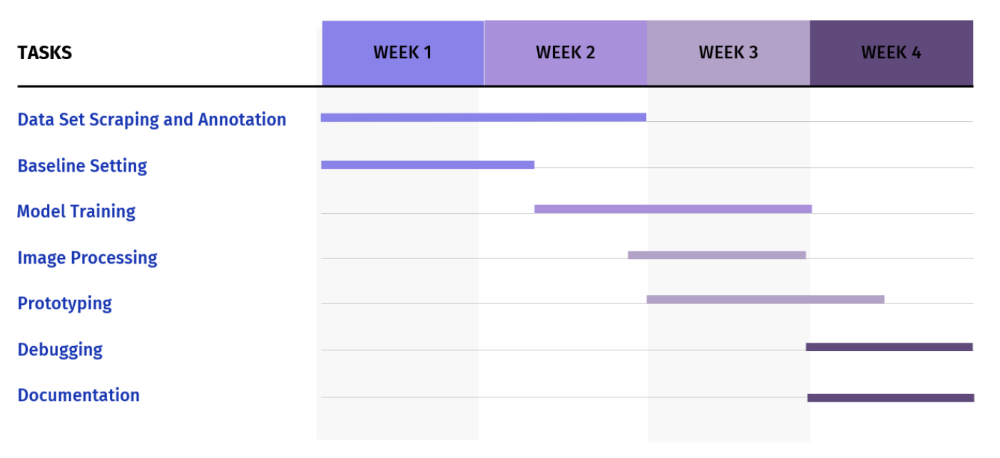
</center>


## 📃 Pipeline

<center>
    
</center>


## 🗂 Dataset

#### 1. Data Scraping

<center>
    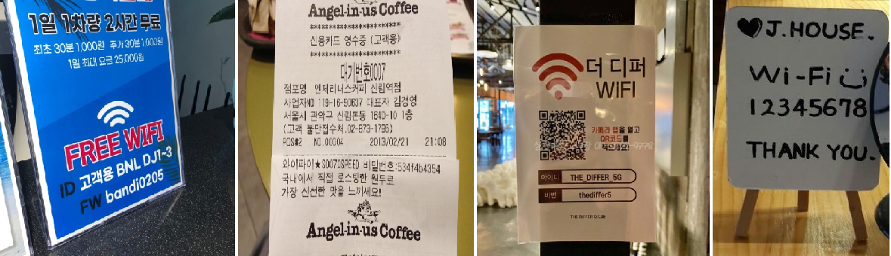
</center>

다양한 플랫폼에서 WiFi 정보를 담은 이미지 데이터 수집 후 cleansing 실시

<br>

#### 2. WiFi template

<center>
    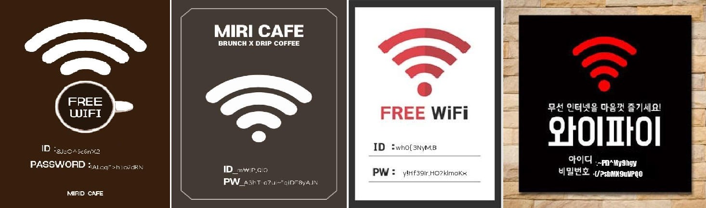
</center>

WiFi template 이미지에 랜덤한 문자열을 ID, PW의 위치에 넣어 합성 이미지 생성

<br>

#### 3. Unity

<center>
    
</center>

Unity를 이용해 가상 현실로 구현한 카페 Scene에 WiFi 포스터를 다양한 위치에 두고 여러 구도에서 이미지 생성

<br>

#### 4. Data Annotation

<center>
    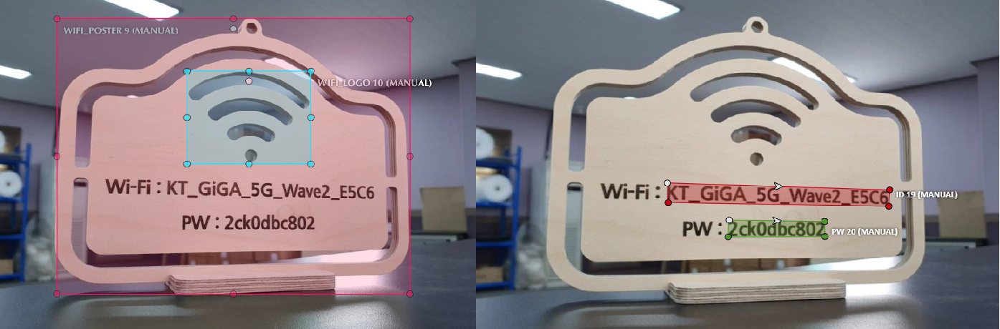
</center>

CVAT Annotation Tool을 활용해 `WiFi Logo`, `WiFi poster`, `ID`, `PW` 에 대한 annotation 진행

<br>


## 🖥Model

### YOLOV5I6 (for Detection)

#### 1. train data

<center style: "">
    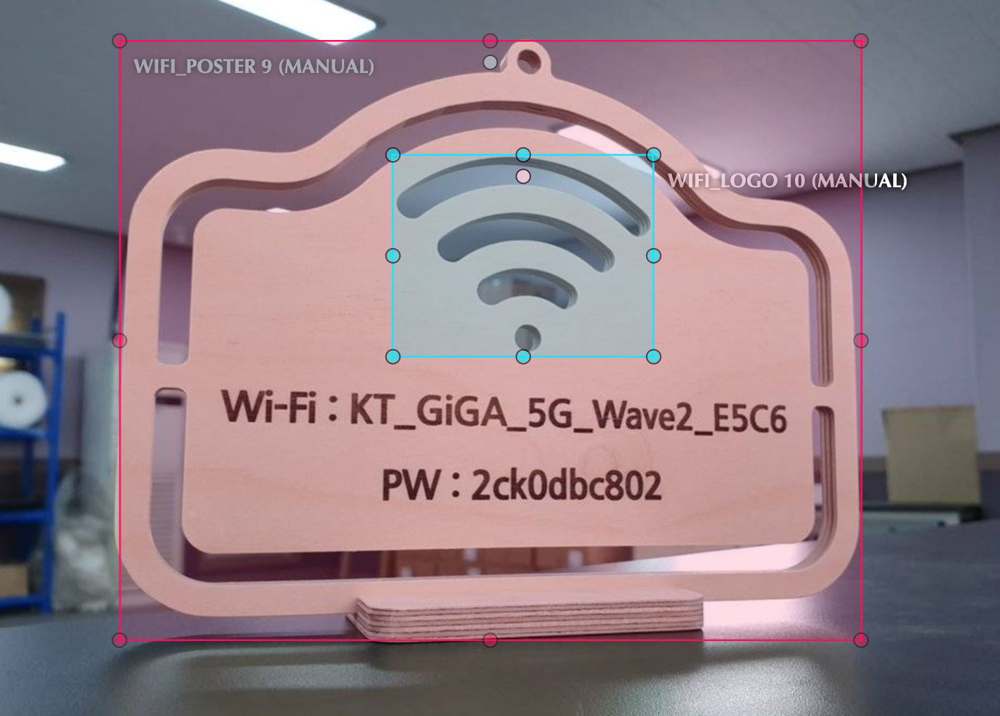
</center>

WiFi Logo와 WiFi Poster를 annotation한 데이터로 학습

#### 2. poster detection

<center>
    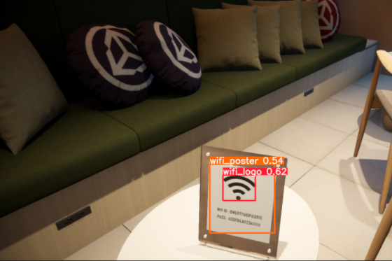
</center>

WiFi Logo가 포함되어 있는 Poster를 detect하고, 해당 영역을 crop하여 사용

<br>


### UNet++ (for Segmentation)

#### 1. train data

<center>
    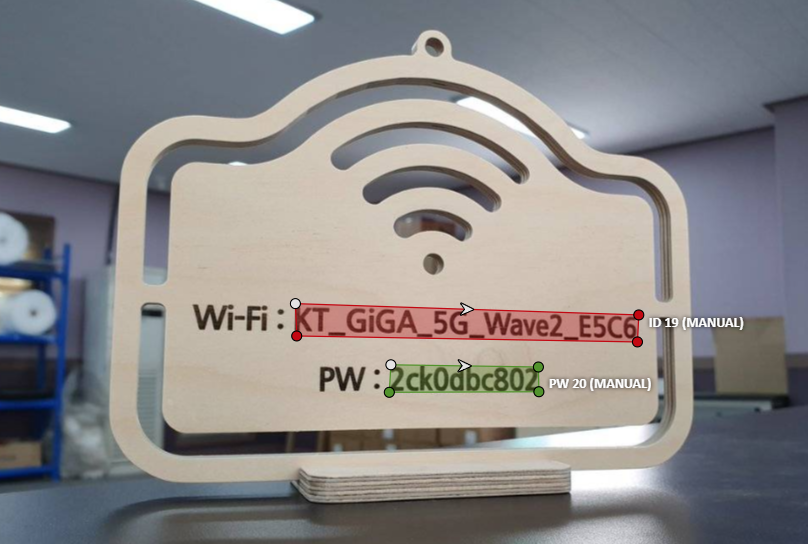
</center>

WiFi ID와 WiFi PW를 annotation한 데이터로 학습

#### 2. 3-channel input

<center>
    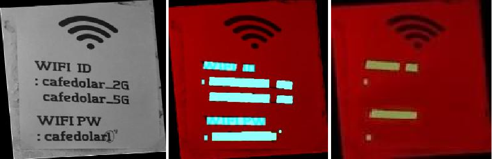
</center>

ch1: gray scale이 적용된 image

ch2: 모든 text 위치의 masking image

ch3: key 값을 가진 text 위치의 masking image


#### 3. Augmentation

- Real Data

<center>
    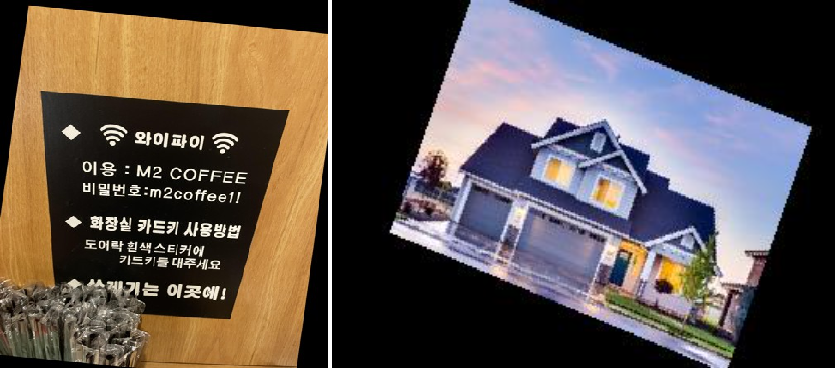
</center>

Blur, ShiftScaleRotate 를 통해 이미지 데이터 증강

- Template Data

<center>
    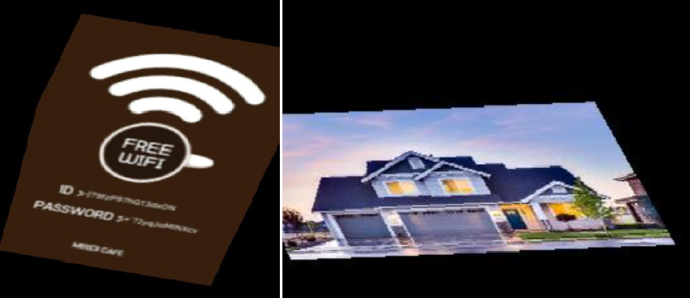
</center>

Real Data에 비해 너무 깨끗한 정면 이미지이므로 MotionBlur, ElasticTransform 를 통해 noise 생성

#### 4. input & output & matching

<center>
    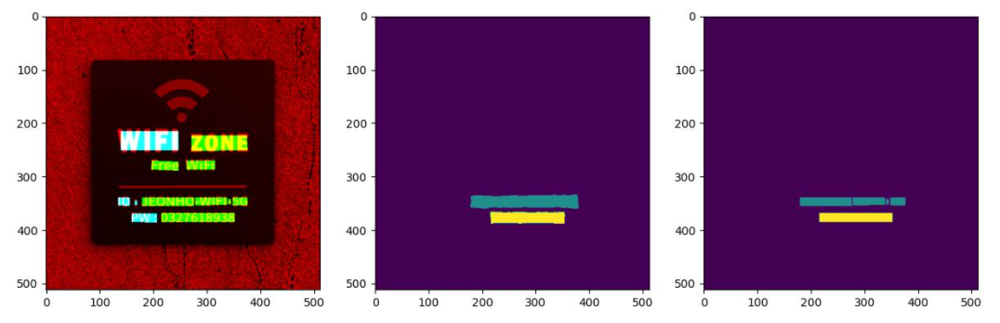
</center>

input, output과 output을 ocr bbox와 matching 한 결과

 `id`, `pw`를 key값으로 지니고 있으며, 각각 text 값과 bbox 위치정보를 담아 post processing에 활용

<br>


## 📥 Pre-Processing

### 1. Rotation

<center>
    
</center>

그림에 대한 설명

<br>

### 2. Image Padding

<center>
    
</center>

그림에 대한 설명

<br>


## 📤 Post-Processing

### 1. Line Alignment (Y-axis)

<center>
    
</center>

그림에 대한 설명

<br>

### 2. Word Merge (X-axis)

<center>
    
</center>

그림에 대한 설명

<br>

### 3. Final postprocessing

<center>
    
</center>

그림에 대한 설명

<br>


## 🖨 Performance

ㅁㄴㅇㄹ


## :wrench: Tech Stack

### Tech Stack

<center>
    
</center>


### System Architecture

<center>
    
</center>


<br>


## :pencil2: ERD

<center>
    
</center>

<br>


## :runner: Steps to run Demo

```bash
$ npm install requirements.txt
$ cd code
$ steamlit run streamlit.py
```

<br>


## 🤼‍♂️Author

🐯**[Roh Hyunsuk](https://github.com/titiman1013)**

🐶 **[Shin Hyeonghwan](https://github.com/vhehduatks)**

🐺 **[Oh Wonju](https://github.com/PancakeCookie)**

🐱 **[Lee Joonhyun](https://github.com/JoonHyun814)**

🦁 **[Lee Hyunsuk](https://github.com/p0tpourri)**

<hr>


## :trophy: Awards

- 


## 📝 License

Copyright © 2022  Sauron's eyes  <br>